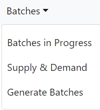
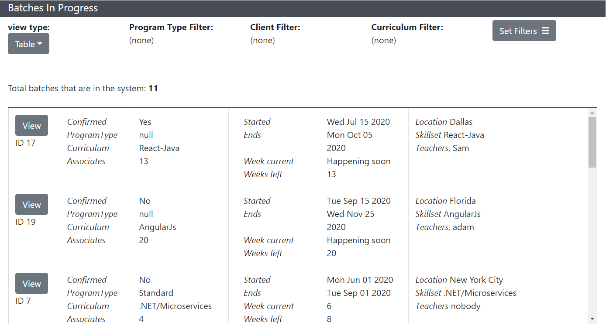
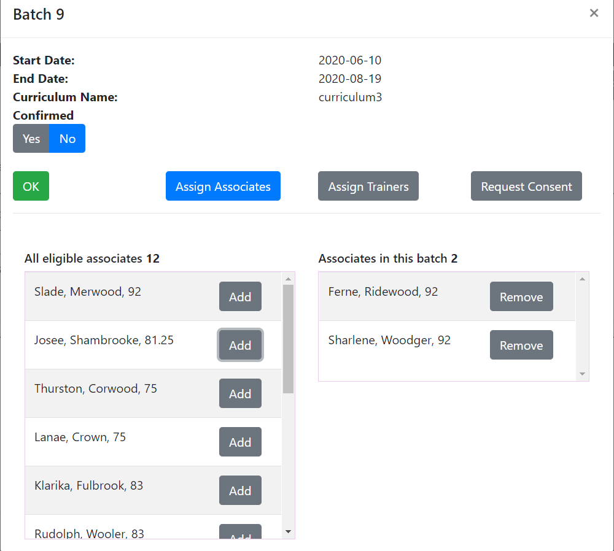
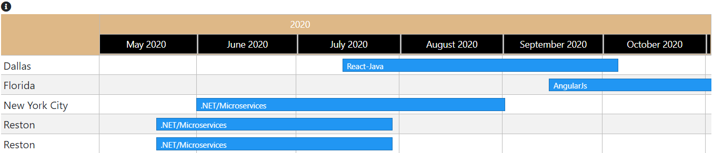
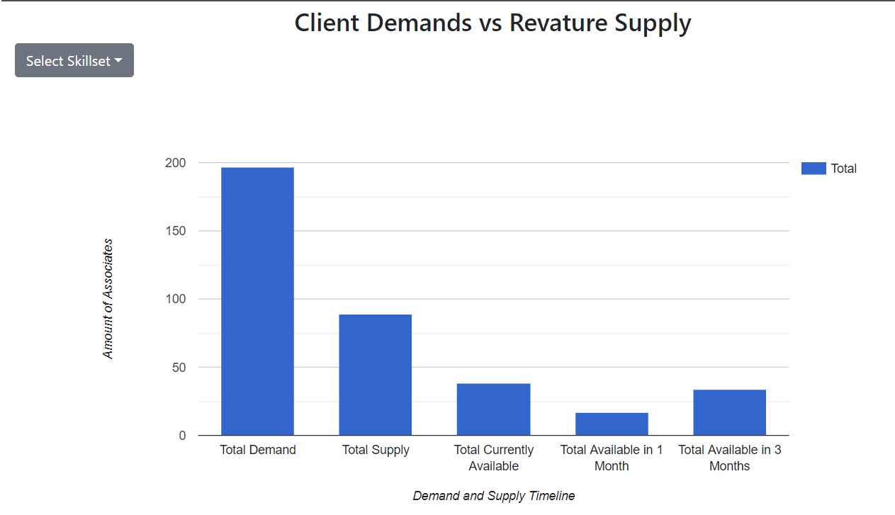
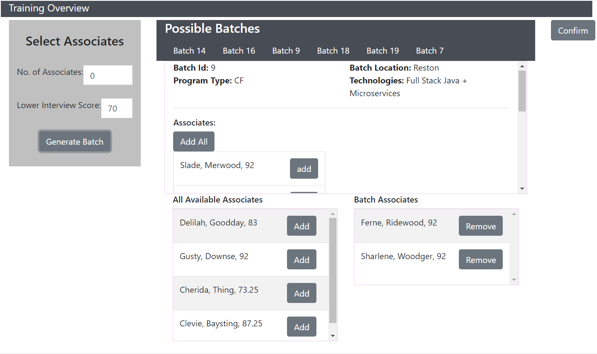

# Reservoir
Reservoir is a tool used by a few internal Revature teams to assist with training planning. Users can retrieve information about the current talent pool, ongoing trainings, and upcoming client demand. Reservoir assists long-term planning by providing hypothetical training schedules built to meet future demand. C-levels using Reservoir can mark trainings as confirmed and specify a trainer.

The Reservoir project is a full-stack web application. The front end is built using JavaScript with React as a framework, while the back end uses Microservice architecture, built with Maven and Java Spring. See below for further details.

## Back End
The back end of Reservoir is responsible for retrieving and altering data in a relational database, generating reports which describe hypothetical training schedules based on client demand and available associates, and sending data via HTTP responses depending on received requests. The back end uses Microservice architecture built using Eureka, Zuul, and Feign.

### Built With
* [Spring Framework](https://spring.io/) - back end framework
* [Maven](https://maven.apache.org/) - dependency management
* [JUnit](https://junit.org/junit5/) - unit testing
* [Spring Cloud](https://github.com/spring-cloud/spring-cloud-netflix) - microservice architecture
  * Eureka - service registry
  * Zuul - gateway
  * Feign Client - HTTP client
  
#### Test Suite [Details](https://docs.google.com/document/d/1fQQrJagsrcd6AHQ7Z_wkABkK3EyJziBAnjlPdNukbU4/edit?usp=sharing)

#### [User Acceptance Test](https://docs.google.com/document/d/1eUouBTZOkbdLaTFhda4TJ9uB1vivKFxqvw8_ien85BE/edit)

### Services
* Data Service - responsible for communicating with the RDS to retrieve and alter data about batches, associates, clients, trainers, skill sets, and more using Spring Data JPA and Hibernate. Also responsible for setting up RESTful endpoints using Spring Web.
* Reports Service - retrieves information from the Data Service and generates potential future batches based on client demand and available associates.
* SQS Service - receives incoming data from an SQS and adds it to the database.
* Registry Service - creates the Microservice Service Registry using Eureka.
* Gateway Service - creates a routing gateway using Zuul.

### Data Service
The Data Service communicates with the RDS using Hibernate as an ORM. The data models that Hibernate uses are: *Associate, Batch, Client, ClientDemand, Consent, Curriculum, Location, Skills, Skillset,* and *Trainer*. Each model has a service and repository for retrieving the data from the database based on specific criteria, as well as a controller which receives HTTP requests and directs them to the appropriate endpoint. For example, sending a GET request to the endpoint "/batches/date/{yyyy-mm-dd}" will return any batches where the provided date falls in between their start date and end date. The front end uses these endpoints to get data to be displayed for the user. It will also send PATCH requests which modify the data, such as adding associates or trainers to a batch. The Reports service will also access these endpoints using a Feign client.

### Reports Service
The Reports Service is registered with the Eureka service registry. This service has a controller which receives HTTP requests and directs them to the appropriate endpoint.
Reports Service uses Feign Client to access Data Service Endpoints to get lists of associates. For instance, sending a GET request to "/reports/datagetter/{lowerInterviewScore}/{noOfAssociates}" will use feign client to send a GET request to Data Service to get a list of all available and active associates. It will then generate a list of associates that can be assigned to the selected batch based on user inputs.

### SQS Service
The SQS Service receives messages in a standard queue from other parts of Revature. The SQS Service manipulates the messages it receives in order to modify the database used by Reservoir. Currently, the SQS Service can add, update, and delete on **Batches, Skills, Associates, and Trainers** depending on the message received. All the messages received are JSON, and have key value pairs for *objectType*, *requestType*, and *values*. The *objectType* is a string that specifies the object that will be passed in. The *values* are the objects contained in an array. The *requestType* is a string that determines which CRUD operation to perform in our SQS Service. It should be noted that *Read* is not an option provided by this service (look into data service or report service).

### Testing
The link below details the QC considersations and testing done for Reservoir:
https://docs.google.com/document/d/1fQQrJagsrcd6AHQ7Z_wkABkK3EyJziBAnjlPdNukbU4/edit#

## Front End
The front end of Reservoir is a single-page application which can display batch data, assign trainers and associates to batches, create consent requests for trainers being assigned to a batch, and generate potential batches based on associate availability and client demand. See "Usage" section for details.

### Built With
* [React](https://reactjs.org/) - front end framework / library for building user interfaces
* [Redux](https://redux.js.org/) - application state manager
* [Reactstrap](https://reactstrap.github.io/) - pre-built, styled components for React using Bootstrap

## Application Structure

Our application is divided into 6 different directories. These are meant to hold files and other sub-directories that are organized functional roles on the frontend. 

### /Components
This is the directory are all the React components of our application. It has other sub-directories and files related to specific components of our applicaion.

#### /Components/Batches-in-progress
This directory contains all the componenets that deal with the batches in progress. 
The filter form and batches in progress view files are presentational components. 

It also contains the following sub-directories:

- Batch-info: This directory contains the components that retrieve the batch data from the back-end server.

- Calender: Contains the display components for the batches displayed as a timeline.

- Table: Contains the components to display the batches in a table format. 

#### /Components/Common
These are reusable components used throughout the application. 

The files not contained in a sub-directory are granular components that pertain to common use components whos usage spans across multiple files.

It also contains the following sub-directories:
- API: Contains components all of the object manipulation methods. 
- Exeptions: Contains custom exceptions that we most frequently encounter throughout our application. 
- Footer: Contains the file footer component that stays in the bottom of our application.

#### /Components/Currently-unused
These are misc components that are not used anywhere in the application.
Have no idea what they were made for by the previous sprint.

#### /Components/Generate-batches 
This directory contains the presentational and functional components for generating batches.
It allows for CRUD opertions for batch manipulation. 

It contains the following sub-directories.

- functions: Contains functions that contains a wrapper for an Axios client.

#### /Components/Supply-demand
Contains components that display the client demands and avaliable supply to that client based on their needs. 

### /Helpers
Components that convert javascript formatted data into a more human readable format. 

### /models
Contains the models that store and format the back-end entities. 

### /Out-of-scope
None of these are currently used or referenced anywhere in our application other than here.

### /PsedoData(don't-delete)
Contains mock data to use as a back up in case there is a need for it. 

### /redux 
All the Redux components are contained here as well as the store. Might restructure the structure the state later on. 

### /stylesheets
Contains CSS components to for styling purposes in our application.
Files not listed in a sub-directory are common througout the application.

The following sub-directories are:

- batches-in-progress: Styling components for the batches in progress components.
- generate-batches: Styling components for the generate batches components. 
- supply-demand: Styling components for the supply and demand components.

### /Tests
This will contain all the tests for application once they are written. 

### Usage

#### Navbar 
The user can use the navigation bar at the top of the application to navigate to every view detailed below.

#### In Progress (/in-progress)
This will lead the user to a view which displays information all the batches currently in progress, as well as all future batches. By default, this is a table, but this can be switched to a calendar view at any time. Clicking on "Set Filters" will bring up a form which will allow the user to filter out batches based on Program Type, Client, and Curriculum.

Clicking "view" will bring up more information about the batch, including its status, associates, and trainers. This view will also allow the user to add and remove associates and trainers to and from the batch, as well set the batch's status to "confirmed". Under "Request Consent", the user can view all available trainers and assign them to the batch if its curriculum corresponds to their skillset. If the user wants to assign a trainer whose skillset does not apply to the curriculum, the user can instead create a consent request, which the trainer can accept or deny.

In the calendar view, the batches are sorted by location, and the calendar can be navigated to view the full time interval of each batch. Right clicking on the batch will show more information, while double clicking on the batch will allow the user to edit it, as above.

#### Supply and Demand (/overview-demand)
This page provides an overview of client demand associated with a particular skillset. Depending on the skillset selected, it generates a graph which shows the total number of associates demanded as well as the number of associates available immediately, in one month, and in three months.

#### Generate Batch (/BatchPage)
This page will allow the users to see all the unconfirmed batches and available associates so, users can generate scenarios about possible batch placements. Based on user inputs, associates can be grouped together and assigned to batches without updating the database. The confirm button can update the database according to the changes that the user made in this section.

# Contributors
[List of Contributors](./contributors.md)

# Acknowledgements
* Thank you to Adam King for teaching us and helping us so much throughout this whole process.
* Thanks to our fearless team leads, Mark Alsip, Dan Brown, and Nick Steen, for taking charge and guiding us.
* Thank you, Revature, for giving us this opportunity.
